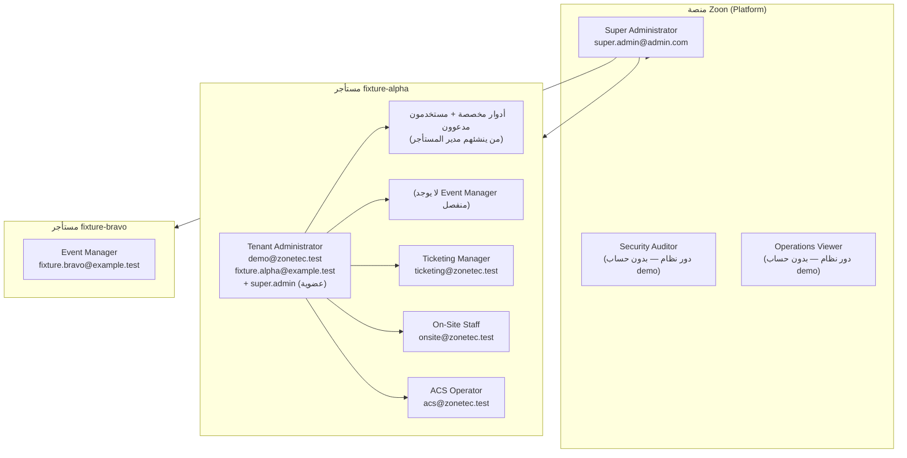
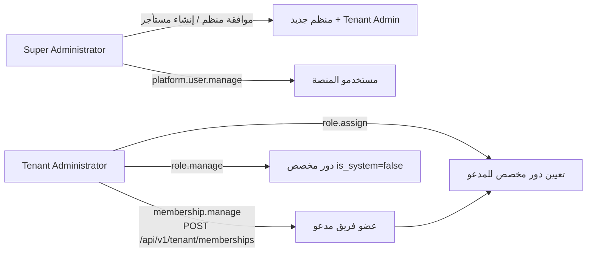

# شجرة المستخدمين والصلاحيات في Zoon

دليل مرجعي لحسابات التجربة (Demo)، التسلسل الهرمي، ومن يستطيع ماذا في المنصة والمستأجر.

> **بيئة التطوير فقط** — تُزرع الحسابات عبر `FoundationSeeder` و`DemoContentSeeder` ولا تُستخدم في الإنتاج.  
> المصدر التنفيذي للصلاحيات: `database/seeders/PermissionSeeder.php`  
> آخر مراجعة: يوليو 2026

---

## 1. الشجرة الهرمية (نظرة عامة)



### طبقات النظام

| الطبقة | الوصف | السياق في الطلب |
|--------|--------|------------------|
| **Platform** | إدارة المنصة كلها (مستأجرون، مستخدمون عالميون، إعدادات الموقع) | بدون `X-Tenant-ID` أو مع صلاحيات `platform.*` |
| **Tenant** | عمليات منظم الفعالية داخل مستأجر واحد | يتطلب `X-Tenant-ID` + صلاحيات `tenant` scope |
| **Public / Kiosk / ACS M2M** | مسارات عامة أو أجهزة — **ليست** RBAC للقوى العاملة | توكن تسجيل / جلسة كشك / بيانات اعتماد تكامل |

---

## 2. المستأجرون التجريبيون

| Slug | الاسم | الحدث التجريبي الرئيسي |
|------|-------|------------------------|
| `fixture-alpha` | Fixture Alpha | فعالية `id=1` (من `DemoContentSeeder`) — التسجيل، الحضور، ACS، الشارات |
| `fixture-bravo` | Fixture Bravo | مستأجر ثان للعزل — حساب `fixture.bravo@example.test` فقط |

---

## 3. الحسابات وكلمات المرور

| البريد | كلمة المرور | دور المنصة | دور المستأجر | المستأجر |
|--------|-------------|------------|--------------|----------|
| `super.admin@admin.com` | `admin1234` (أو من `.env`) | Super Administrator (`*`) | Tenant Administrator (`*`) | fixture-alpha |
| `demo@zonetec.test` | `DemoMeet2026!` | — | Tenant Administrator (`*`) | fixture-alpha |
| `fixture.creator@example.test` | `synthetic-only-creator-password` | Super Administrator | Tenant Administrator | fixture-alpha |
| `fixture.alpha@example.test` | `synthetic-only-alpha-password` | — | Tenant Administrator | fixture-alpha |
| `fixture.bravo@example.test` | `synthetic-only-bravo-password` | — | Event Manager | fixture-bravo |
| `ticketing@zonetec.test` | `TicketDemo2026!` | — | Ticketing Manager | fixture-alpha |
| `onsite@zonetec.test` | `OnsiteDemo2026!` | — | On-Site Staff | fixture-alpha |
| `acs@zonetec.test` | `AcsDemo2026!` | — | ACS Operator | fixture-alpha |

### طلبات منظمين (بدون دخول)

| البريد | الحالة | الغرض |
|--------|--------|-------|
| `pending.organizer@demo.zonetec.test` | pending | اختبار الموافقة من Platform → Organizer Requests |
| `rejected.organizer@demo.zonetec.test` | rejected | اختبار الرفض ورسالة البريد |

**دورة الموافقة:** نموذج عام → pending → موافقة Super Admin → `User` + `Tenant Administrator` + بريد ترحيب.

---

## 4. أدوار النظام وصلاحياتها

`[*]` = كل مفاتيح الصلاحيات في النطاق (tenant أو platform).

### 4.1 أدوار المنصة (Platform)

| الدور | الصلاحيات | حساب Demo |
|-------|-----------|-----------|
| **Super Administrator** | `*` (كل صلاحيات المنصة) | super.admin, fixture.creator |
| **Security Auditor** | `platform.audit.view`, `platform.audit.export`, `platform.audit.verify` | — |
| **Operations Viewer** | `operations.health.view`, `platform.configuration.view` | — |

**صلاحيات المنصة الرئيسية:**

| المفتاح | الوظيفة |
|---------|---------|
| `platform.tenant.view` / `.manage` | عرض وإدارة المستأجرين |
| `platform.user.view` / `.manage` | مستخدمو المنصة |
| `platform.role.view` / `.manage` / `.assign` | أدوار المنصة وتعيينها |
| `platform.audit.*` | سجل تدقيق المنصة |
| `platform.feature_flag.*` | أعلام الميزات |
| `platform.configuration.view` | مخططات الإعداد |
| `platform.access.recover` | استعادة وصول (مثلاً آخر مدير مستأجر) |
| `operations.health.view` | صحة العمليات |

### 4.2 أدوار المستأجر (Tenant — أدوار نظام)

| الدور | ملخص | `*`؟ |
|-------|------|-----|
| **Tenant Administrator** | كل شيء داخل المستأجر | نعم |
| **Event Manager** | فعاليات، تسجيل، تذاكر، حضور، شارات، check-in، kiosk، ACS (إعداد أساسي) | لا |
| **Ticketing Manager** | تذاكر، طلبات، استرداد، حضور (قراءة)، credentials | لا |
| **On-Site Staff** | مسح، مكتب يدوي، طباعة شارات، walk-up | لا |
| **ACS Operator** | مناطق، ممرات، صحة البوابات، طوارئ ACS | لا |

#### Tenant Administrator — كل صلاحيات المستأجر

يشمل على سبيل المثال لا الحصر: `membership.manage`, `role.manage`, `role.assign`, `event.*`, `registration.manage`, `ticketing.manage`, `order.*`, `attendee.*`, `credential.*`, `identity.*`, `wallet.pass.*`, `checkin.*`, `kiosk.*`, `badge.*`, `acs.*`, `audit.*`, `configuration.view`.

#### Event Manager — القائمة الكاملة (من `FoundationSeeder`)

```
tenant.view, membership.view, role.view, audit.view, configuration.view,
event.view, event.manage, event.publish, event.cancel, event.reopen, event.archive,
registration.manage, ticketing.manage, order.view, order.manage,
attendee.view, attendee.manage, credential.view, credential.revoke, credential.reissue,
identity.configure, identity.review, identity.data.view,
wallet.pass.view, wallet.pass.generate, wallet.pass.manage,
checkin.scan.submit, checkin.dashboard.view, checkin.desk.perform,
kiosk.manage, kiosk.health.view,
badge.print, badge.reprint, badge.template.manage, attendee.walkup.register,
acs.configure, acs.events.view, acs.health.view
```

**لا يملك:** `membership.manage`, `role.manage`, `role.assign`, `payment.refund` (حصري لـ Ticketing Manager), `acs.emergency.manage`, `identity.data.manage`, `checkin.scan.override`.

#### Ticketing Manager

```
event.view, ticketing.manage, order.view, order.manage, payment.refund,
attendee.view, credential.view, credential.revoke, credential.reissue,
wallet.pass.view, wallet.pass.generate
```

#### On-Site Staff

```
event.view, attendee.view, credential.view,
checkin.scan.submit, checkin.scan.override, checkin.dashboard.view, checkin.desk.perform,
kiosk.health.view, badge.print, badge.reprint, attendee.walkup.register
```

#### ACS Operator

```
event.view, acs.configure, acs.events.view, acs.health.view, acs.emergency.manage
```

---

## 5. من يضيف من؟ (شجرة الدعوة والتفويض)



| الفاعل | يستطيع إضافة | يستطيع تعيين دور | قيود |
|--------|--------------|------------------|------|
| **Super Administrator** | مستأجرين، مستخدمي منصة، موافقة منظمين | أدوار منصة + مدير مستأجر | وصول كامل للمنصة |
| **Tenant Administrator** | عضويات مستأجر (دعوة مستخدم جديد أو موجود) | أدوار **مخصصة** أنشأها هو + تعيينها | لا يعدّل أدوار النظام |
| **Event Manager** | — | — | لا `membership.manage` |
| **Ticketing / On-Site / ACS** | — | — | أدوار تشغيلية فقط |

### قواعد صفحة `/admin/users`

تطبّق `MembershipVisibility::scopeAssignableMemberships`:

1. تظهر فقط العضويات التي **`created_by_user_id` = أنت** (أنت من دعوتهم).
2. **لا** يظهر من لديهم دور **نظام** نشط (`is_system = true`) — مثل On-Site Staff و Ticketing Manager المزروعين.
3. **لا** تظهر أنت في القائمة.
4. الأدوار القابلة للتعيين من `/admin/roles`: أدوار **مخصصة** أنشأتها أنت (`created_by_user_id` + `is_system = false`).

لذلك `demo@zonetec.test` يرى قائمة فارغة حتى يضيف مستخدمين عبر **إضافة مستخدم** ثم يعيّن لهم دوراً مخصصاً.

### قواعد صفحة `/admin/roles`

- تعرض فقط الأدوار **غير النظامية** (`is_system = false`).
- إنشاء/تعديل دور يتطلب `role.manage`.
- تعيين دور على عضو يتطلب `role.assign`.

---

## 6. خريطة الواجهة ↔ الصلاحيات

| القسم في القائمة | صلاحية العرض | أزرار/إجراءات | صلاحية الإجراء |
|------------------|--------------|---------------|----------------|
| Overview | `tenant.view` | — | — |
| Events | `event.view` | إنشاء/تعديل | `event.manage` |
| | | نشر | `event.publish` |
| | | إلغاء | `event.cancel` |
| Registration | `registration.manage` | بناء النموذج | `registration.manage` |
| Ticketing | `ticketing.manage` | أنواع تذاكر / أسعار | `ticketing.manage` |
| Orders | `order.view` | إدارة | `order.manage` |
| Attendees | `attendee.view` | طباعة شارة / check-in يدوي | `badge.print`, `checkin.desk.perform` |
| | | إلغاء/إعادة إصدار credential | `credential.revoke`, `credential.reissue` |
| Credentials | `credential.view` | إلغاء / إعادة إصدار | `credential.revoke`, `credential.reissue` |
| Check-in | `checkin.dashboard.view` | مسح | `checkin.scan.submit` |
| | | مكتب يدوي | `checkin.desk.perform` |
| Kiosk | `kiosk.manage` / `kiosk.health.view` | إقران/تقاعد | `kiosk.manage` |
| Badges | `badge.template.manage` | قوالب | `badge.template.manage` |
| | | مهام طباعة | `badge.print` / `badge.reprint` |
| ACS | `acs.configure` | مناطق/ممرات/قواعد | `acs.configure` |
| | | سجلات/صحة | `acs.events.view`, `acs.health.view` |
| | | طوارئ | `acs.emergency.manage` |
| Admin → Users | `membership.view` | إضافة/تعليق | `membership.manage` |
| Admin → Roles | `role.view` | إنشاء/تعديل | `role.manage` |
| Admin → Audit | `audit.view` | تصدير | `audit.export` |
| Platform (منفصل) | `platform.*` | مستأجرون، إعدادات موقع، طلبات منظمين | حسب المفتاح |

> القائمة الجانبية تُفلتر من الخادم (`can` في Inertia). إخفاء زر في الواجهة **لا يعني** منع API — الخادم هو المرجع.

---

## 7. مصفوفة سريعة: ماذا يرى كل حساب Demo؟

| الحساب | Platform | Events كاملة | Users/Roles | Ticketing | Check-in / Badges | ACS |
|--------|----------|--------------|-------------|-----------|-------------------|-----|
| super.admin | ✅ | ✅ | ✅ (كل المستأجر) | ✅ | ✅ | ✅ |
| demo@ | ❌ | ✅ | ✅ (مدعوون فقط) | ✅ | ✅ | ✅ |
| fixture.bravo | ❌ | ✅ (bravo) | محدود | ✅ | ✅ | إعداد فقط |
| ticketing@ | ❌ | قراءة | ❌ | ✅ | قراءة credentials | ❌ |
| onsite@ | ❌ | قراءة | ❌ | ❌ | ✅ | ❌ |
| acs@ | ❌ | قراءة | ❌ | ❌ | ❌ | ✅ |

---

## 8. دورة حياة المستخدم

```
[إنشاء حساب]
   ├─ موافقة منظم (Platform)
   ├─ دعوة مدير مستأجر (POST memberships)
   └─ تسجيل عام (خارج نطاق القوى العاملة)
        ↓
   User (status: active)
        ↓
   TenantMembership (status: active, created_by_user_id → من دعاه)
        ↓
   TenantRoleAssignment (دور نظام أو مخصص)
        ↓
   جلسة دخول → SessionContextBuilder → can map
        ↓
   Sidebar + PermissionGate + API middleware
        ↓
   عمليات → Audit Log (tenant أو platform)
```

---

## 9. أدوار مخصصة (Custom Roles)

| الخاصية | دور نظام | دور مخصص |
|---------|----------|----------|
| `is_system` | `true` | `false` |
| التعديل/الحذف | ممنوع | مسموح لمن لديه `role.manage` |
| يظهر في `/admin/roles` | لا | نعم |
| يُعيَّن من `/admin/users` | لا (للفريق المدعو) | نعم |
| من ينشئه | Seeder (`grantor`) | المستخدم الحالي |

**مثال عملي مع `demo@zonetec.test`:**

1. `/admin/roles` → إنشاء دور «مشرف تسجيل» بصلاحيات `attendee.view`, `order.view`.
2. `/admin/users` → **إضافة مستخدم** (اسم، بريد، كلمة مرور).
3. اختيار الدور المخصص → **تعيين**.
4. المستخدم الجديد يسجّل دخول ويرى فقط ما تسمح به صلاحيات دوره.

---

## 10. مسارات API الشائعة للتجربة

| العملية | Method | المسار | صلاحية |
|---------|--------|--------|--------|
| دعوة عضو | POST | `/api/v1/tenant/memberships` | `membership.manage` |
| تعيين دور | POST | `/api/v1/tenant/role-assignments` | `role.assign` |
| إلغاء credential | POST | `/api/v1/tenant/events/{id}/credentials/{id}/revoke` | `credential.revoke` |
| طباعة شارة | POST | `/api/v1/tenant/events/{id}/badge-print-jobs` | `badge.print` |
| check-in يدوي | POST | `/api/v1/tenant/events/{id}/scans` (`manual_desk`) | `checkin.desk.perform` |

كل طلبات المستأجر تحتاج هيدر `X-Tenant-ID` + جلسة Sanctum (أو استخدم `apiFetch` من الواجهة).

---

## 11. للتجربة السريعة

1. **منظم فعاليات:** `demo@zonetec.test` / `DemoMeet2026!` → Overview → Events → فعالية 1 → Attendees.
2. **منصة:** `super.admin@admin.com` / `admin1234` → Organizer Requests، Site Settings، Tenants.
3. **ميداني:** `onsite@zonetec.test` / `OnsiteDemo2026!` → Check-in / Manual Desk.
4. **إضافة فريق:** كـ demo → `/admin/roles` (دور مخصص) → `/admin/users` (إضافة مستخدم + تعيين).

---

## 12. مراجع في الكود

| الموضوع | الملف |
|---------|-------|
| حسابات Demo | `database/seeders/DemoAccounts.php` |
| أدوار وتعيينات | `database/seeders/FoundationSeeder.php` |
| كatalog الصلاحيات | `database/seeders/PermissionSeeder.php` |
| فلترة قائمة Users | `app/Modules/AdminConsole/Application/MembershipVisibility.php` |
| خريطة UI | `specs/008-tailadmin-ui-redesign/rbac-ui-map.md` |
| محتوى فعالية alpha | `database/seeders/DemoContentSeeder.php` |
| اختيار منظم الفعالية | `app/Modules/Events/Application/Support/ResolvesEventOrganizer.php` |

---

## 13. المستخدمون الثلاثة الأساسيون (المرحلة المكتملة)

ثلاثة أدوار تمثل ما اكتمل تنفيذه حتى الآن في المنصة. كل دور مربوط بحساب Demo أو مسار عام، مع خريطة للسيناريو مقابل الكود الفعلي.

### 13.1 Platform Admin — مسؤول منصة Zonetec

| البند | القيمة |
|-------|--------|
| **حساب Demo** | `super.admin@admin.com` / `admin1234` |
| **دور المنصة** | Super Administrator (`*`) |
| **دور المستأجر** | Tenant Administrator على `fixture-alpha` (للتجربة داخل مستأجر) |

**السيناريو → التنفيذ**

| الخطوة | الحالة | أين في النظام |
|--------|--------|---------------|
| دخول لوحة Zonetec كـ Super Admin | ✅ | `/dashboard` ثم قسم Platform |
| إنشاء Tenant جديد | ✅ | `/platform/tenants` → نموذج **Add tenant** + اختيار **Admin user** (`initial_admin_user_id`) |
| ضبط إعدادات العميل (لغة، منطقة زمنية، إقامة بيانات) | ✅ جزئي | حقول Tenant: `default_locale`, `timezone`, `data_residency_region` — العملة وإعدادات الأمان المتقدمة عبر `platform.configuration` |
| إنشاء أول مستخدم عند العميل (Organizer Admin) | ✅ | عبر `initial_admin_user_id` عند إنشاء Tenant، أو موافقة طلب منظم من `/platform/organizer-requests` |
| تعيين صلاحيات المنظم | ✅ | دور **Tenant Administrator** أو **Event Manager** (أدوار نظام) |
| مراقبة صحة النظام | ✅ | `/platform/health` — `operations.health.view` |
| Audit Logs للمنصة | ✅ | `/platform/audit` — `platform.audit.*` |
| تعطيل Tenant / مستخدم | ✅ | PATCH `/api/v1/platform/tenants/{id}` + إدارة مستخدمي المنصة |
| SaaS / On-premise / ترخيص محلي | ⏳ مستقبلي | غير منفّذ بعد — `data_residency_region` و feature flags فقط |
| Venue Marketplace / نزاعات الإيجار | ⏳ مستقبلي | غير منفّذ |

**ملاحظة مهمة — اختيار المنظم عند إنشاء فعالية:**  
عندما يدخل **Super Admin** على مستأجر وينشئ فعالية (`/tenant/events/create`)، يجب اختيار **منظم الفعالية** من قائمة أعضاء المستأجر الذين لديهم `event.manage`. يُخزَّن الاختيار في `events.created_by_user_id`. المنظم العادي (`demo@zonetec.test`) لا يرى هذا الحقل — تُسجَّل الفعالية باسمه تلقائياً.

**تجربة سريعة:** `super.admin@admin.com` → Platform → Tenants / Organizer Requests / Health / Audit → ثم Events → New event (اختر المنظم).

---

### 13.2 Event Organizer — منظم الفعالية

| البند | القيمة |
|-------|--------|
| **حساب Demo الرئيسي** | `demo@zonetec.test` / `DemoMeet2026!` |
| **دور المستأجر** | Tenant Administrator (`*`) على `fixture-alpha` |
| **حساب بديل (Event Manager فقط)** | `fixture.bravo@example.test` على `fixture-bravo` |

**السيناريو → التنفيذ**

| الخطوة | الحالة | أين في النظام |
|--------|--------|---------------|
| إنشاء Event | ✅ | `/tenant/events/create` |
| اختيار Event Tier (Corporate / Public / VIP / VVIP) | ✅ | حقل **Event tier** في إعداد الفعالية + قيد DB |
| Branding (شعار، نطاق، محتوى) | ✅ جزئي | `brand_reference`, `domain_reference` + `event_branding` |
| Registration Form | ✅ | `/tenant/events/{id}/registration` |
| Ticket Types + Price Tiers + مخزون | ✅ | Ticketing — يمنع overselling عبر `ticket_inventory` |
| الدفع (Adapter-based) | ✅ | بوابة Mock/قابلة للتبديل — `specs/002-.../payment-adapter.md` |
| التحقق من الهوية (OTP / Gov / Face) | ✅ | `/tenant/events/{id}/identity` |
| الدخول (QR / Kiosk / Badge / ACS) | ✅ | Check-in, Kiosk, Badges, ACS |
| نشر الفعالية | ✅ | `event.publish` |
| Revoke / Reissue Credential | ✅ | Attendees / Credentials — `credential.revoke`, `credential.reissue` |
| Dashboard مباشر يوم الحدث | ✅ | Check-in summary + ACS health |
| تقارير بعد الحدث | ✅ جزئي | `/tenant/events/{id}/reports` |

**الفعالية التجريبية الرئيسية:** `zonetec-summit-2026` (id=1) — 12 حاضر مسجّل، check-in، شارات، ACS، هوية.

**تجربة سريعة:** `demo@zonetec.test` → Events → Zonetec Summit 2026 → Registration / Ticketing / Attendees / Check-in.

---

### 13.3 Attendee — الحاضر / الزائر

| البند | القيمة |
|-------|--------|
| **حساب دخول** | **لا يوجد** — الحاضر لا يسجّل دخولاً للوحة التحكم |
| **مسار التسجيل** | صفحة عامة `/register/{slug}` أو نطاق الفعالية |
| **حضور Demo مسجّل** | `attendee1@demo.zonetec.test` … `attendee12@demo.zonetec.test` (من `DemoContentSeeder`) |

**السيناريو → التنفيذ**

| الخطوة | الحالة | أين في النظام |
|--------|--------|---------------|
| فتح رابط التسجيل + Branding | ✅ | `PublicRegistrationEvent` |
| اختيار نوع التذكرة + ملء النموذج | ✅ | حقول النموذج الديناميكي + consent |
| تسجيل مجاني → QR فوري | ✅ | `CompleteFreeRegistration` |
| تسجيل مدفوع → QR بعد الدفع فقط | ✅ | webhook الدفع — لا credential بدون دفع ناجح |
| Email/SMS + Wallet Pass | ✅ | محولات الإشعارات و Apple/Google Wallet |
| تحقق هوية إن لزم | ✅ | مسار `/identity` للحاضر |
| مسح QR عند البوابة | ✅ | Scan + ACS + anti-passback |
| رفض QR قديم بعد Reissue | ✅ | `ScanDecisionEvaluator` |
| رفض دخول ثانٍ (Single-entry) | ✅ | `anti_passback_states` |
| رفض credential ملغي | ✅ | `credential_revoked` |
| بحث بالاسم/إيميل عند فقدان QR | ✅ | Manual Desk — `LookupAttendeesQuery` |

**تجربة سريعة:** افتح صفحة تسجيل فعالية Summit المنشورة → سجّل بإيميل جديد → استلم QR → جرّب المسح من `onsite@zonetec.test`.

---

### 13.4 ملخص الحسابات الثلاثة

| الشخصية | الحساب / المسار | كلمة المرور | السياق |
|---------|-----------------|-------------|--------|
| Platform Admin | `super.admin@admin.com` | `admin1234` | Platform + `fixture-alpha` |
| Event Organizer | `demo@zonetec.test` | `DemoMeet2026!` | `fixture-alpha` فقط |
| Attendee | تسجيل عام (بدون login) | — | Public registration |

---

*حدّث هذا القسم عند إضافة On-premise licensing أو Venue Marketplace أو تغيير سلوك اختيار المنظم.*

---

*هذا الملف هو المرجع العربي لشجرة المستخدمين والصلاحيات في بيئة التطوير. حدّثه عند تغيير `FoundationSeeder` أو `PermissionSeeder`.*


--------------------------------------------------------------------------------------------

=== fixture.alpha@example.test ===
Password: synthetic-only-alpha-password
Platform roles: NONE
Tenant fixture-alpha: Tenant Administrator
  Tenant perms: 46/50
Platform perms: 0/15

=== fixture.bravo@example.test ===
Password: synthetic-only-bravo-password
Platform roles: NONE
Tenant fixture-bravo: Event Manager
  Tenant perms: 14/50
Platform perms: 0/15

=== fixture.creator@example.test ===
Password: synthetic-only-creator-password
Platform roles: NONE
Platform perms: 0/15

=== platform.admin@admin.com ===
Password: admin1234
Platform roles: Platform Administrator
Platform perms: 15/15


=== Seeded user credentials & permission audit ===

User: Meeting Demo Organizer
  Email:    demo@zonetec.test
  Password: (unknown — check .env or seeder)
  Platform roles: NONE
  Tenant fixture-alpha: roles=Tenant Administrator
    Effective tenant permissions: 46 / 50
  Effective platform permissions: 0 / 15

User: Fixture alpha
  Email:    fixture.alpha@example.test
  Password: synthetic-only-alpha-password
  Platform roles: NONE
  Tenant fixture-alpha: roles=Tenant Administrator
    Effective tenant permissions: 46 / 50
  Effective platform permissions: 0 / 15

User: Fixture bravo
  Email:    fixture.bravo@example.test
  Password: synthetic-only-bravo-password
  Platform roles: NONE
  Tenant fixture-bravo: roles=Event Manager
    Effective tenant permissions: 14 / 50
  Effective platform permissions: 0 / 15

User: Fixture Creator
  Email:    fixture.creator@example.test
  Password: synthetic-only-creator-password
  Platform roles: NONE
  Tenant memberships: NONE
  Effective platform permissions: 0 / 15

User: Platform Administrator
  Email:    platform.admin@admin.com
  Password: admin1234
  Platform roles: Platform Administrator
  Tenant fixture-alpha: roles=Tenant Administrator
    Effective tenant permissions: 46 / 50
  Effective platform permissions: 15 / 15

=== SystemRoleSeeder role definitions (expected) ===

Platform roles: Platform Administrator, Security Auditor, Operations Viewer
Tenant roles (per tenant): Tenant Administrator, Event Manager, Ticketing Manager, On-Site Staff, ACS Operator

Run after `php artisan db:seed` to verify assignments.


مدير منصة (إعدادات المنصة وطلبات المنظمين)
super.admin@admin.com
admin1234
Platform + Tenant Admin

مدير مستأجر (تجربة كاملة للمنظم)
demo@zonetec.test
DemoMeet2026!
Tenant Administrator

fixture.creator@example.test
synthetic-only-creator-password
Platform + Tenant Admin

fixture.alpha@example.test
synthetic-only-alpha-password
Tenant Administrator
مستأجر alpha

fixture.bravo@example.test
synthetic-only-bravo-password
Event Manager (35 صلاحية)
صلاحيات محدودة

طاقم ميداني (مسح وطباعة شارات الحضور)
onsite@zonetec.test
OnsiteDemo2026!
On-Site Staff
مسح + مكتب يدوي

ACS (بوابات ومناطق)
acs@zonetec.test
AcsDemo2026!
ACS Operator
تحكم وصول

تذاكر (طلبات وتذاكر)
ticketing@zonetec.test
TicketDemo2026!
Ticketing Manager
تذاكر وطلبات


------------------------------------------------------------------------------------


1) توليد مفاتيح متطابقة
cd /var/www/zonetec_tickets
php -r '
$pair = sodium_crypto_sign_keypair();
$keyId = "staging-" . date("Ymd");
$ref = "CREDENTIAL_STAGING_PRIVATE_KEY";
echo "CREDENTIAL_CURRENT_KEY_ID=" . $keyId . PHP_EOL;
echo "CREDENTIAL_KEY_RING=" . json_encode([
  $keyId => [
    "status" => "active",
    "public_key" => sodium_bin2base64(
      sodium_crypto_sign_publickey($pair),
      SODIUM_BASE64_VARIANT_URLSAFE_NO_PADDING
    ),
    "private_key_reference" => $ref,
  ],
], JSON_UNESCAPED_SLASHES) . PHP_EOL;
echo $ref . "=" . sodium_bin2base64(
  sodium_crypto_sign_secretkey($pair),
  SODIUM_BASE64_VARIANT_URLSAFE_NO_PADDING
) . PHP_EOL;
'
انسخ المخرجات الثلاث. ل .env

