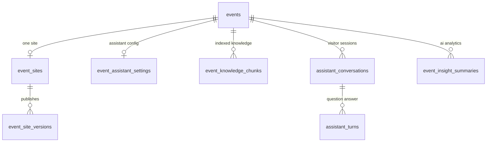

# Phase 1 Data Model: Event Website Builder and AI Assistance

Conventions follow the accepted schema style in this repository: `id` primary
key, `unsignedBigInteger` scope columns, microsecond timestamps, a composite
scope foreign key to `events(tenant_id, id)` so a row can never reference an
event in another tenant, tenant-first indexes, and `CHECK` constraints for status
enums (see
[create_registration_form_tables.php](../../database/migrations/2026_07_03_000010_create_registration_form_tables.php)).

## Entity overview



## 1. `event_sites`

One editable website per event.

| Column | Type | Notes |
|---|---|---|
| `id` | bigint PK | |
| `tenant_id` | bigint | scope, part of composite FK |
| `event_id` | bigint | scope, unique — one site per event |
| `status` | string(24) | `draft`, `published`, `unpublished` |
| `page_mode` | string(16) | `single` now; `multi` reserved for the later increment |
| `draft_blocks` | json | ordered array of block objects (schema below) |
| `draft_updated_by_user_id` | bigint null | last editor |
| `draft_revision` | unsigned int | optimistic concurrency token, incremented per save |
| `live_version_id` | bigint null | FK to `event_site_versions` |
| `published_at` | timestamp(6) null | last publish time |
| `unpublished_at` | timestamp(6) null | |
| `settings` | json null | site-level options (show assistant, contact action, SEO title/description per locale) |
| `created_at` / `updated_at` | timestamp(6) | |

Constraints and indexes: unique `(tenant_id, event_id)`; unique
`(tenant_id, event_id, id)` for composite child references; FK
`(tenant_id, event_id)` → `events(tenant_id, id)`; index
`(tenant_id, status)`; `CHECK` on `status` and `page_mode`.

**Validation rules**: `draft_blocks` must be an array of at most 40 valid blocks;
publishing requires at least one visible `hero` block with a title in at least
one locale and a resolvable register call to action.

## 2. `event_site_versions`

Immutable published snapshots.

| Column | Type | Notes |
|---|---|---|
| `id` | bigint PK | |
| `tenant_id`, `event_id` | bigint | scope |
| `event_site_id` | bigint | parent site |
| `version` | unsigned int | sequential per site |
| `status` | string(24) | `published`, `superseded` |
| `blocks` | json | frozen block set |
| `blocks_hash` | char(64) | sha-256 of canonical block JSON, used for publish idempotency |
| `published_by_user_id` | bigint null | |
| `published_at` | timestamp(6) | required when `status = published` |
| `created_at` / `updated_at` | timestamp(6) | |

Constraints and indexes: unique `(tenant_id, event_site_id, version)`; unique
`(tenant_id, event_id, id)`; composite FK to `event_sites`; index
`(tenant_id, event_id, status)`; `CHECK` status enum; `CHECK` that
`published_at` and `published_by_user_id` are present for published rows.

**State transitions**: `published` → `superseded` when a newer version is
published. Rows are never updated otherwise; the model blocks updates to
persisted version content.

## 3. Site block schema (JSON, validated server-side)

```json
{
  "id": "b_hero_1",
  "type": "hero",
  "visible": true,
  "content_en": { "title": "Zonetec Summit 2026", "subtitle": "Riyadh" },
  "content_ar": { "title": "قمة زونتك 2026", "subtitle": "الرياض" },
  "options": { "image_path": "event-sites/1/hero.jpg", "align": "center" },
  "refs": { "agenda_source": "event", "register_target": "registration" }
}
```

Supported `type` values: `hero`, `about`, `agenda`, `speakers`, `venue`, `faq`,
`sponsors`, `gallery`, `register_cta`. Rules:

- `id` unique within the block set, `[a-z0-9_-]{1,40}`.
- `type` from the supported list; unknown types are rejected.
- Text content lives only in `content_en` / `content_ar`; each value is a string
  or an array of strings/objects for repeatable items (FAQ entries, sponsor
  names).
- `options` accepts only keys declared for that block type; unknown keys rejected.
- `refs` may reference `event` live data (`agenda`, `speakers`, `venue`) or the
  registration target; a reference to a deleted resource degrades to an empty
  block at render time and blocks publication only for `register_cta`.
- Maximum 20,000 characters of text per block and 40 blocks per site.

## 4. `event_assistant_settings`

Per-event assistant configuration and index state.

| Column | Type | Notes |
|---|---|---|
| `id` | bigint PK | |
| `tenant_id`, `event_id` | bigint | scope, unique per event |
| `enabled` | boolean | default false |
| `display_name_en` / `display_name_ar` | string(120) null | |
| `greeting_en` / `greeting_ar` | string(500) null | |
| `fallback_action` | string(24) | `registration`, `contact`, `none` |
| `fallback_contact_email` | string(190) null | required when `fallback_action = contact` |
| `daily_question_limit` | unsigned int | default from config |
| `index_version` | unsigned int | incremented per successful rebuild |
| `indexed_at` | timestamp(6) null | freshness for answers |
| `index_status` | string(24) | `pending`, `ready`, `failed` |
| `index_error_code` | string(64) null | non-sensitive reason |
| `chunk_count` | unsigned int | last successful chunk count |
| `created_at` / `updated_at` | timestamp(6) | |

Constraints: unique `(tenant_id, event_id)`; composite FK to events; `CHECK` on
`fallback_action` and `index_status`.

## 5. `event_knowledge_chunks`

Retrievable per-event knowledge.

| Column | Type | Notes |
|---|---|---|
| `id` | bigint PK | |
| `tenant_id`, `event_id` | bigint | scope; every retrieval filters on both |
| `index_version` | unsigned int | matches the settings row when live |
| `source_type` | string(32) | `site_block`, `event_core`, `agenda`, `venue`, `zone`, `registration` |
| `source_id` | string(64) | block id or record id, used for citations |
| `locale` | string(5) | `en`, `ar` |
| `title` | string(255) null | human-readable citation label |
| `content` | text | chunk text, max ~1,200 characters |
| `content_hash` | char(64) | dedupe within an index version |
| `embedding` | json null | float vector; null when no embedding provider is enabled |
| `embedding_model` | string(64) null | provider/model identity for the vector |
| `token_estimate` | unsigned int | used for context budgeting |
| `created_at` / `updated_at` | timestamp(6) | |

Constraints and indexes: composite FK to events; index
`(tenant_id, event_id, index_version)`; index
`(tenant_id, event_id, locale)`; unique
`(tenant_id, event_id, index_version, content_hash)`; `FULLTEXT (content, title)`
for the lexical candidate stage; `CHECK` on `source_type` and `locale`.

**Lifecycle**: a rebuild writes a new `index_version` for the scope and deletes
older versions for that scope in the same transaction, so retrieval always sees
one complete generation.

## 6. `assistant_conversations`

| Column | Type | Notes |
|---|---|---|
| `id` | bigint PK | |
| `tenant_id`, `event_id` | bigint | scope |
| `public_id` | char(36) | opaque identifier returned to the visitor |
| `locale` | string(5) | conversation language |
| `visitor_hash` | char(64) | salted hash of IP + user agent for throttling; no raw IP stored |
| `started_at` | timestamp(6) | |
| `last_activity_at` | timestamp(6) | |
| `turn_count` | unsigned int | |
| `purge_after` | timestamp(6) | retention deadline from config |
| `created_at` / `updated_at` | timestamp(6) | |

Constraints and indexes: unique `(tenant_id, public_id)`; composite FK to events;
index `(tenant_id, event_id, last_activity_at)`; index `purge_after` for the
retention sweep.

## 7. `assistant_turns`

| Column | Type | Notes |
|---|---|---|
| `id` | bigint PK | |
| `tenant_id`, `event_id`, `conversation_id` | bigint | scope and parent |
| `question` | text | visitor message (personal data possible) |
| `answer` | text null | null when unavailable or refused |
| `outcome` | string(24) | `answered`, `unanswered`, `refused`, `throttled`, `unavailable` |
| `citations` | json null | array of `{source_type, source_id, title}` |
| `provider_key` | string(32) null | which adapter answered |
| `latency_ms` | unsigned int null | |
| `prompt_tokens` / `completion_tokens` | unsigned int null | cost accounting |
| `created_at` / `updated_at` | timestamp(6) | |

Constraints and indexes: composite FK to `assistant_conversations`; index
`(tenant_id, event_id, outcome, created_at)` to power the unanswered-question
review; `CHECK` on `outcome`.

**Retention**: rows are deleted with their conversation by the retention sweep or
by an organizer delete request; deletion is audited.

## 8. `event_insight_summaries`

| Column | Type | Notes |
|---|---|---|
| `id` | bigint PK | |
| `tenant_id`, `event_id` | bigint | scope |
| `metric_window` | string(32) | e.g. `all_time`, `last_14_days` |
| `payload_hash` | char(64) | hash of the aggregate payload, cache key |
| `metrics_payload` | json | the exact aggregates sent to the model (aggregates only) |
| `summary_en` / `summary_ar` | text null | generated narrative per locale |
| `highlights` | json null | short structured bullets for card display |
| `provider_key` | string(32) | |
| `generated_by_user_id` | bigint null | requesting organizer |
| `generated_at` | timestamp(6) | |
| `expires_at` | timestamp(6) | freshness boundary |
| `created_at` / `updated_at` | timestamp(6) | |

Constraints and indexes: unique
`(tenant_id, event_id, metric_window, payload_hash)`; composite FK to events;
index `(tenant_id, event_id, generated_at)`.

**Allow-listed payload keys**: `registered_count`, `checked_in_count`,
`rejected_count`, `duplicate_count`, `orders_total`, `orders_by_status`,
`paid_orders`, `revenue_minor`, `currency`, `payment_success_rate`,
`credentials_issued`, `credentials_revoked`, `registrations_by_day`,
`checkins_by_day`, `funnel`, `category_breakdown`, `ticket_type_breakdown`,
`zone_occupancy_summary`, `top_reject_reasons`, `capacity`, `event_window`.
Anything not on this list — names, emails, phones, national identifiers,
free-text answers, per-attendee rows — is unreachable by construction.

## 9. Reused entities (not modified)

- `events` — scope owner; `slug`, `status` and shareable statuses gate public access.
- `event_branding` — theme and verified host used for rendering and resolution.
- `event_agenda_items`, `event_venues`, `event_zones`, `event_images` — knowledge sources rendered by blocks and indexed for retrieval.
- Existing report and occupancy sources — the only inputs to analytics payloads.
- `audit_logs` — receives publish, configuration, transcript and insight events.

No existing table is altered by this feature.
